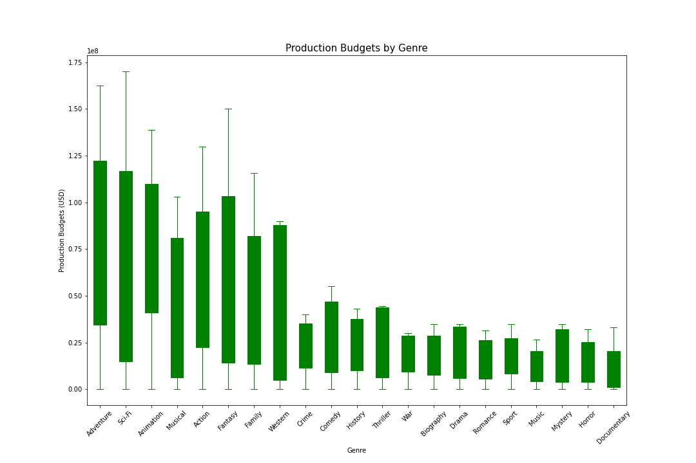

<div md-colors="{background: 'grey-50'}">


# Project Overview
### Phase 1 Project - Flatiron - Data Science
* Provide Insight/Recomendations For a New Movie Studio
* Use Exploratory Data Analysis

Brad Blackwood

December 2021

#### Data Provided - .zippedData/
* [Box Office Mojo](https://www.boxofficemojo.com/)
* [IMDB](https://www.imdb.com/)
* [Rotten Tomatoes](https://www.rottentomatoes.com/)
* [TheMovieDB](https://www.themoviedb.org/)
* [The Numbers](https://www.the-numbers.com/)

#### Imports

``` python
import pandas as pd
import numpy as np
import matplotlib.pyplot as plt
```

#### Methods

* My method of normalizing the data was ROI (Return on Investment) to compare genres, film lengths, and release dates.
* ROI = (Revenue - Cost)/(Cost)

#### Anaylsis/Graphics

1. 
2. 
3. 
4. 

#### Contact Info
* Email: brad.blackwood.03@gmail.com
* LinkedIn: https://www.linkedin.com/in/blackwoodbs/
* GitHub: blackwoodbs
